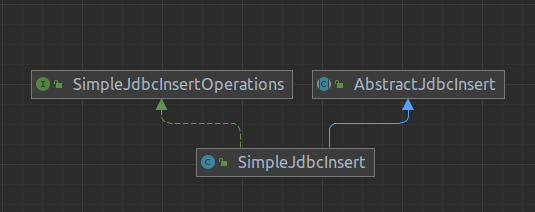

= Spring JDBC в деталях: SimpleJdbcInsert

Решил я проанализировать источники трафика на моём сайте и обнаружил, что на сайт частенько заходят в поисках информации о `SimpleJdbcInsert`, о чём я толком не рассказывал.
Поэтому этой статьёй я постараюсь закрыть этот пробел.

`SimpleJdbcInsert` - один из вспомогательных инструментов, предоставляемых Spring Framework JDBC для работы с реляционными базами данных, задача которого - предоставить удобный механизм для вставки новых строк в таблицы.

== Структура классов

Прежде всего предлагаю посмотреть на структуру классов, реализуемых `SimpleJdbcInsert`:

`SimpleJdbcInsert` реализует интерфейс `SimpleJdbcInsertOperations` и расширяет класс `AbstractJdbcInsert`, который и содержит всю основную логику вставки новых строк в таблицы.
По сути `SimpleJdbcInsert` реализует классический шаблон проектирования "Адаптер", адаптируя поведение `AbstractJdbcInsert` к интерфейсу `SimpleJdbcInsertOperations`.

== Создание и настройка

`SimpleJdbcInsert` и `AbstractJdbcInsert` предоставляют два конструктора, которые принимают в качестве единственного аргумента либо экземпляр класса `JdbcTemplate`, либо - `DataSource`.
Поскольку для фактического выполнения insert-запроса используется экземпляр класса `JdbcTemplate`, а он обычно доступен в контексте приложения, основанного на Spring Boot, я рекомендую выбирать соответствующий конструктор.
В противном случае будет создан новый экземпляр JdbcTemplate на основе переданного экземпляра `DataSource`.

`SimpleJdbcInsertOperations` объявляет следующие методы для конфигурирования:

- `withTableName` - для указания названия таблицы, в которую будут выполняться вставки новых строк

- `withSchemaName` - для указания названия схемы базы данных

- `withCatalogName` - для указания названия каталога базы данных

- `usingColumns` - для перечисления названий колонок, в которые будут вставляться новые данные

- `usingGeneratedKeyColumns` - для указания названий колонок, значения которых будут сгенерированы на стороне базы данных и должны будут возвращены

- `withoutTableColumnMetaDataAccess` - для отключения доступа Spring JDBC к метаданным колонок.
Рекомендую делать это только в крайних случаях, так как доступ к метаданным колонок может указать на наличие ошибок заранее при компиляции экземпляра SimpleJdbcInsert.

- `includeSynonymsForTableColumnMetaData` - для использования синонимов (специфично для Oracle)

Все методы настройки по своей сути являются обёртками вокруг методов `set...` класса AbstractJdbcInsert для возможности объединения их вызовов в цепочки.

=== Примеры создания и настройки экземпляров SimpleJdbcInsert

Для примеров ниже будет использоваться следующая схема БД PostgreSQL:

[source,sql]
----
create schema if not exists sandbox;

create table sandbox.t_todo
(
    id           serial primary key,
    c_title      varchar(250),
    c_details    text,
    c_created_at timestamp default now()
);
----

Пример создания экземпляра `SimpleJdbcInsert` для вставки новых строк с колонками `c_title` и `c_details` в таблицу `t_todo` схемы `sandbox` с возвратом сгенерированного значения из колонок `id` и `c_created_at`:

[source,java]
----
@Configuration
class DbBeans {

    @Bean
    SimpleJdbcInsert todoSimpleJdbcInsert(JdbcTemplate jdbcTemplate) {
        // Создание экземпляра с использованием JdbcTemplate
        var insert = new SimpleJdbcInsert(jdbcTemplate)
                        // Схема sandbox
                        .withSchemaName("sandbox")
                        // Таблица t_todo
                        .withTableName("t_todo")
                        // Вставка данных в колонки c_title и c_details
                        .usingColumns("c_title", "c_details")
                        // Возврат сгенерированных значений колонок id и c_created_at
                        .usingGeneratedKeyColumns("id");
        // "Компиляция" экземпляра SimpleJdbcInsert для исключения каких-либо изменений в дальнейшем
        insert.compile();

        return insert;
    }
}
----

Альтернативный вариант создания, когда `SimpleJdbcInsert` расширяется собственным классом:

[source,java]
----
class TodoSimpleJdbcInsert extends SimpleJdbcInsert {

    TodoSimpleJdbcInsert(JdbcTemplate jdbcTemplate) {
        super(jdbcTemplate);
        this.withSchemaName("sandbox")
            // Таблица t_todo
            .withTableName("t_todo")
            // Вставка данных в колонки c_title и c_details
            .usingColumns("c_title", "c_details")
            // Возврат сгенерированных значений колонок id и c_created_at
            .usingGeneratedKeyColumns("id", "c_created_at")
            // "Компиляция" экземпляра SimpleJdbcInsert для исключения каких-либо изменений в дальнейшем
            .compile();
    }
}
----

Ещё один вариант, когда расширяется `AbstractJdbcInsert`:

[source,java]
----
class TodoSimpleJdbcInsert extends AbstractJdbcInsert {

    TodoSimpleJdbcInsert(JdbcTemplate jdbcTemplate) {
        super(jdbcTemplate);
        // Схема sandbox
        this.setSchemaName("sandbox");
        // Таблица t_todo
        this.setTableName("t_todo");
        // Вставка данных в колонки c_title и c_details
        this.setColumnNames(List.of("c_title", "c_details"));
        // Возврат сгенерированных значений колонок id и c_created_at
        this.setGeneratedKeyNames("id");
        // "Компиляция" экземпляра SimpleJdbcInsert для исключения каких-либо изменений в дальнейшем
        this.compile();
    }
}
----

Созданные экземпляры класса `SimpleJdbcInsert` и классов-наследников `AbstractJdbcInsert` являются потоко-безопасными, поэтому для каждой таблицы можно создать один экземпляр соответствующего класса и использовать его для всех случаев.

== Использование

`SimpleJdbcInsert` и `AbstractJdbcInsert` для вставки строк предоставляют по два варианта каждого метода, разница заключается в типе аргумента, в котором передаются подставляемые в запрос данные: `Map<String, Object>` или `SqlParameterSource`.

=== execute

Метод `execute` возвращает в ответ количество затронутых запросом строк, которое в большинстве случаев должно равняться единице.

[source,java]
----
@Test
void execute_ReturnsAffectedRowsCount() {
    // given
    var title = "Новая задача";
    var details = "Описание новой задачи";

    // when
    var affectedRows = todoSimpleJdbcInsert
            .execute(Map.of("c_title", title, "c_details", details));

    // then
    assertEquals(1, affectedRows);
}
----

=== executeAndReturnKey

Метод `executeAndReturnKey` возвращает в ответ сгенерированное на стороне базы данных значение колонки, название которой было указано в `usingGeneratedKeyColumns` или `setGeneratedKeyNames`, однако работать этот метод будет только в том случае, если такая колонка была указана одна, а её тип данных можно выразить в виде `java.lang.Number`.
Типичное применение этого метода - вставка новой строки с получением сгенерированного идентификатора строки.

[source,java]
----
@Test
void executeAndReturnKey_ReturnsKey() {
    // given
    var title = "Новая задача";
    var details = "Описание новой задачи";

    var insert = new SimpleJdbcInsert(this.jdbcTemplate);
    insert.withSchemaName("sandbox")
            .withTableName("t_todo")
            .usingColumns("c_title", "c_details")
            // сгенерированные значения нужно получать только для колонки id
            .usingGeneratedKeyColumns("id");

    // when
    var key = insert.executeAndReturnKey(Map.of("c_title", title, "c_details", details));

    // then
    assertEquals(1, key); // 1 - идентификатор, полученный из БД
}
----

=== executeAndReturnKeyHolder

Метод `executeAndReturnKeyHolder` возвращает в ответ экземпляр `KeyHolder`, при помощи которого можно получить доступ к сгенерированным на стороне базы данных значениям колонок.
Это может быть полезно, когда в таблице присутствует несколько колонок, значение которых должно быть сгенерировано при вставке новой строки.
В моём примере есть две такие колонки: `id` - идентификатор строки и `c_created_at` - метка времени создания записи.

[source,java]
----
@Test
void executeAndReturnKeyHolder_ReturnsKeyHolder() {
    // given
    var title = "Новая задача";
    var details = "Описание новой задачи";

    // when
    var keyHolder = this.insert
            .executeAndReturnKeyHolder(Map.of("c_title", title, "c_details", details));

    // then
    assertEquals(1, keyHolder.getKeys().get("id"));
    assertNotNull(keyHolder.getKeys().get("c_created_at"));
}
----

=== executeBatch
`executeBatch` - метод для пакетной вставки новых строк в таблицу, возвращающий массив количества вставленных строк для каждой вставки.
По сути это аналог `execute` для пакетной вставки.

[source,java]
----
@Test
void executeBatch_ReturnsAffectedRowsCounts() {
    // given
    var title1 = "Первая задача";
    var details1 = "Описание первой задачи";

    var title2 = "Вторая задача";
    var details2 = "Описание второй задачи";

    // when
    var affectedRows = this.insert
            .executeBatch(Map.of("c_title", title1, "c_details", details1),
                    Map.of("c_title", title2, "c_details", details2));

    // then
    assertArrayEquals(new int[]{1, 1}, affectedRows);
}
----

== Рекомендации
* Создавайте экземпляры класса `SimpleJdbcInsert` и классов-наследников `AbstractJdbcInsert` с использованием конструктора, принимающего в качестве аргумента экземпляр класса `JdbcTemplate`
* Для `AbstractJdbcInsert` применяйте шаблон проектирования "Адаптер класса"
* Для `SimpleJdbcInsert` применяйте шаблон проектирования "Адаптер объекта"
* Вызывайте метод `compile` для "компиляции" объекта, этим вы гарантируете, что в промежутке между созданием экземпляра класса и его первым использованием не произойдёт никаких изменений.

== Демонстрация примеров и полезные ссылки
Для демонстрации описанных в статье примеров я создал проект, в котором можно проверить работу `SimpleJdbcInsert` на примере баз данных H2  (встроенная) и PostgreSQL (Docker, запуск с профилем pgindocker).

* https://github.com/alex-kosarev/spring-jdbc-in-details-simple-jdbc-insert[Демонстрационный проект]
* https://docs.spring.io/spring-framework/docs/current/reference/html/data-access.html#jdbc-simple-jdbc-insert-1[Документация по Spring Framework JDBC SimpleJdbcInsert]
* https://alexkosarev.name/2023/02/20/spring-jdbc-in-details-simplejdbcinsert/[Статья на сайте]